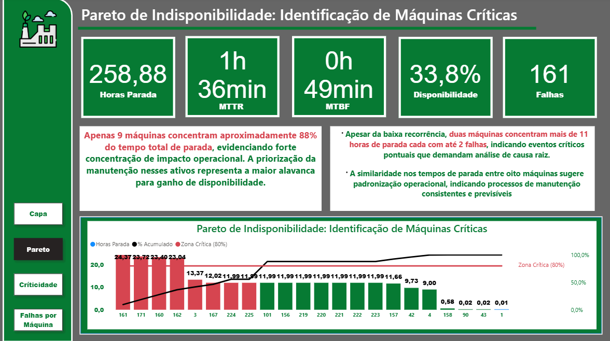

# 📊 Análise de Confiabilidade Industrial  
### ETL • SQL • Power BI • Engenharia de Dados aplicada à Manutenção


---

## 🎯 Visão Geral

Este projeto transforma dados brutos de alarmes industriais em **insights acionáveis para manutenção**, utilizando uma abordagem end-to-end:

- 🔹 ETL em Python  
- 🔹 Modelagem em Star Schema (MySQL)  
- 🔹 SQL analítico (CTE + Window Functions)  
- 🔹 Dashboards no Power BI  

O objetivo é identificar **máquinas críticas**, reduzir indisponibilidade e orientar decisões de manutenção com base em dados.

---


## 🏗️ Arquitetura

CSV (Eventos de Alarme)
↓
ETL (Python)
↓
Star Schema (MySQL)
↓
SQL Analítico
↓
Power BI (DAX + Dashboards)


---

## 📥 Fonte de Dados

Eventos de alarmes industriais extraídos de CSV.

**Principais campos:**

- `datetime` → data e hora do evento  
- `assetid` → identificador do ativo  
- `state` → transições (N2A, A2N)  
- `alarmseverityname` → severidade do alarme  

---

## ⚙️ ETL — Transformações

- Padronização de colunas  
- Conversão de datas  
- Remoção de duplicados  
- Criação de `MachineKey`  
- Ordenação temporal de eventos  
- Criação de colunas auxiliares (`prev_state`, `next_state`)  

### 🔹 Dimensão criada

- `Dim_AlarmSeverity` → padronização de severidade com chave numérica  

---

## 📊 Métricas de Confiabilidade

### MTTR (Mean Time to Repair)
- Tempo médio de reparo por falha  

### MTBF (Mean Time Between Failures)
- Tempo médio entre falhas  

### Outras métricas:
- Total de paradas  
- Disponibilidade  
- Taxa de falha  
- Horas totais de parada  

---

## 🧱 Modelagem de Dados

### Star Schema

**Dimensões:**
- `Dim_Machine`
- `Dim_Date`
- `Dim_AlarmSeverity`

**Fato:**
- `Fact_Paradas`

**Tabelas analíticas:**
- `KPI_Por_Maquina`
- `KPI_Global`
- `Gold_Final_Completa`

---

## 🧠 SQL Analítico (Diferencial)

### 🔹 CTE (Common Table Expressions)

```sql
WITH Base AS (
    SELECT 
        MachineKey,
        COUNT(ParadaID) AS Falhas,
        SUM(MTTR_Amplo) / 60 AS Horas_Parada
    FROM Fact_Paradas
    GROUP BY MachineKey
)
SELECT * FROM Base;

Window Functions (Pareto)
SUM(Horas_Parada) OVER()

SUM(Horas_Parada) OVER(ORDER BY Horas_Parada DESC)
🔹 Percentual Acumulado
ROUND(
    SUM(Horas_Parada) OVER(ORDER BY Horas_Parada DESC)
    / SUM(Horas_Parada) OVER() * 100, 2
)

## 🔹 Window Function (pareto)

SUM(Horas_Parada) OVER()

SUM(Horas_Parada) OVER(ORDER BY Horas_Parada DESC)

## 🔹 % Acumulado

ROUND(
    SUM(Horas_Parada) OVER(ORDER BY Horas_Parada DESC)
    / SUM(Horas_Parada) OVER() * 100, 2
)
```

## 📈 Power BI — Análise
Estratégia
Importação da tabela fato sem agregação
Criação de métricas via DAX
Separação entre camada de dados e camada analítica

## 📊  Principais Métricas

Falhas = COUNT(Fact_Paradas[ParadaID])

MTTR = DIVIDE(SUM(Fact_Paradas[MTTR_Amplo]), [Falhas]) / 60

MTBF = DIVIDE(SUM(Fact_Paradas[MTBF_Amplo]), [Falhas]) / 60

## 📊 Dashboards

## 🟢 Pareto de Indisponibilidade
Identificação das máquinas responsáveis por ~80% do tempo de parada
####🟡 Mapa de Criticidade
Scatter (MTBF vs MTTR)
Análise de frequência vs impacto
## 🔴 Análise Dinâmica
Alternância entre:
Eventos críticos (baixo volume, alto impacto)
Falhas recorrentes (alta frequência)

## 💡 Principais Insights
Pequeno grupo de máquinas concentra a maior parte da indisponibilidade
Máquinas com poucas falhas podem gerar alto impacto operacional
Alta recorrência indica necessidade de manutenção preventiva
Padrões de tempo de parada sugerem processos operacionais padronizados

## 🎯 Modelo de Criticidade
(Impacto * 0.5) +
(Frequência * 0.3) +
(Disponibilidade * 0.2)

## 💣 Diferenciais do Projeto

✔ Uso de CTEs e Window Functions
✔ Modelagem Star Schema
✔ Integração SQL + Power BI
✔ Análise baseada em engenharia de confiabilidade (RCM)
✔ Aplicação do princípio de Pareto (80/20)
✔ Separação entre eventos críticos e recorrentes

## 🚀 Evoluções Futuras
Classificação automática de paradas (corretiva vs preventiva)
Integração com SAP PM / Work Orders
Análise de confiabilidade avançada (Weibull, survival analysis)
Carga incremental de dados
Cálculo de OEE por período

## 📌 Conclusão

Este projeto demonstra uma abordagem prática de:

Engenharia de Dados
Modelagem analítica
BI orientado à decisão

Transformando dados industriais em insights estratégicos para aumento de disponibilidade e eficiência operacional.

## 👨‍💻 Autor
**Victor Biscaia**
* [](https://www.linkedin.com/in/victor-biscaia/)
* [](https://github.com/vbiscaia-ai)
